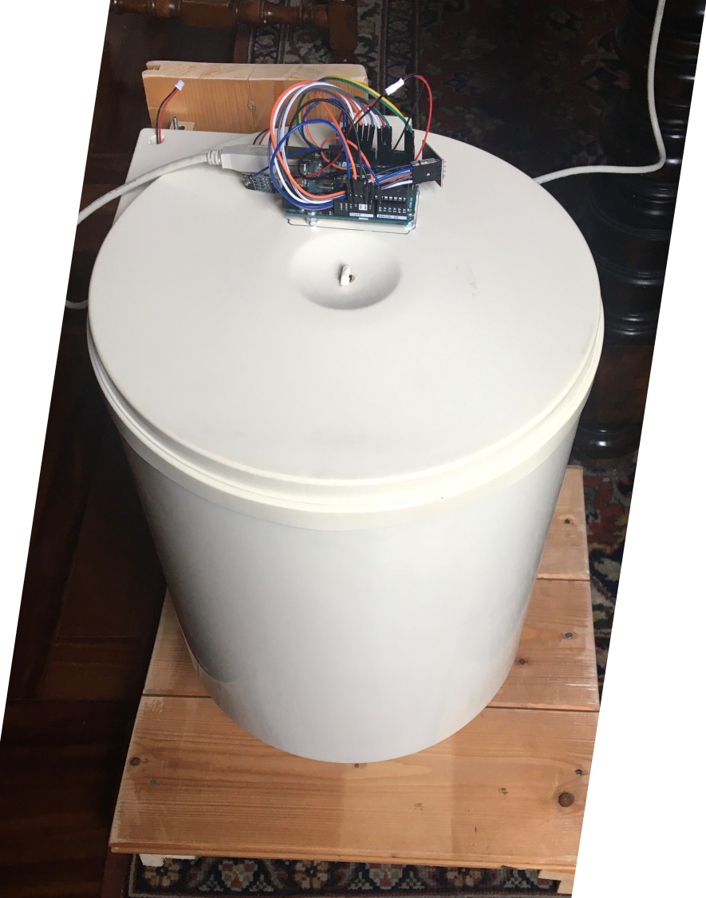
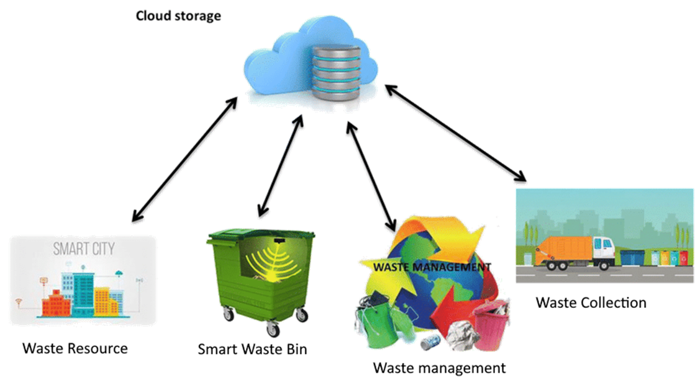
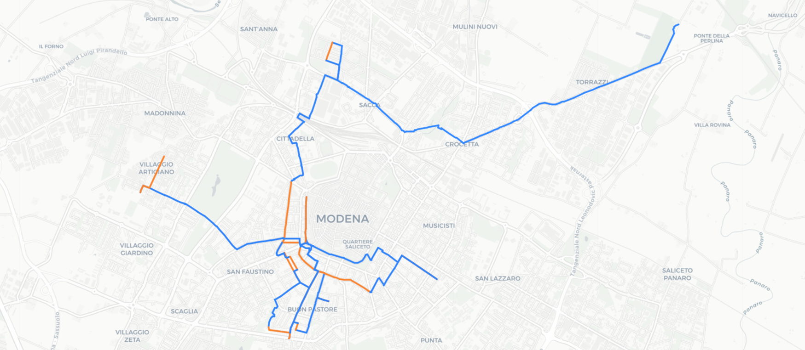
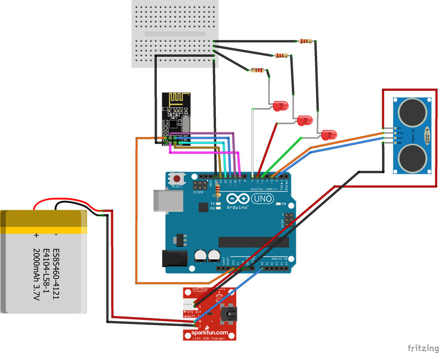
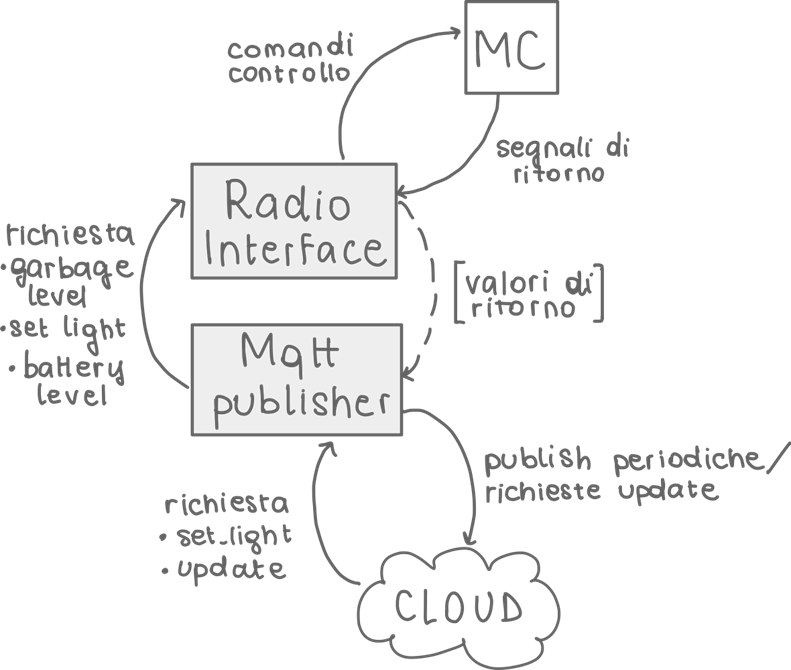
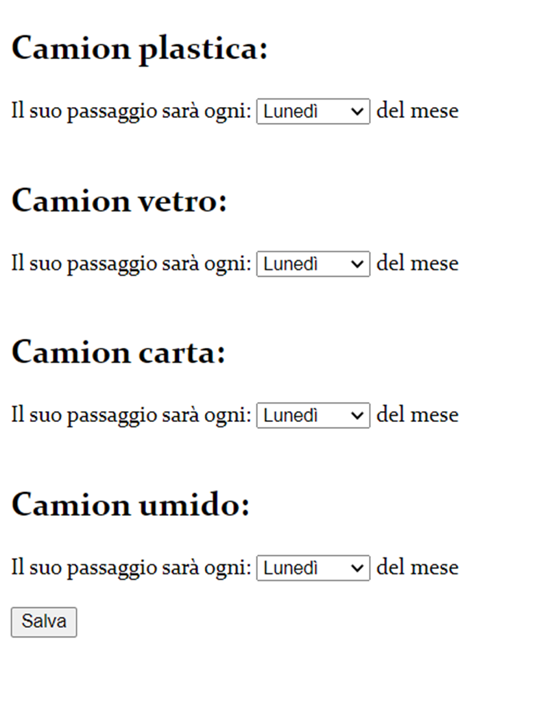
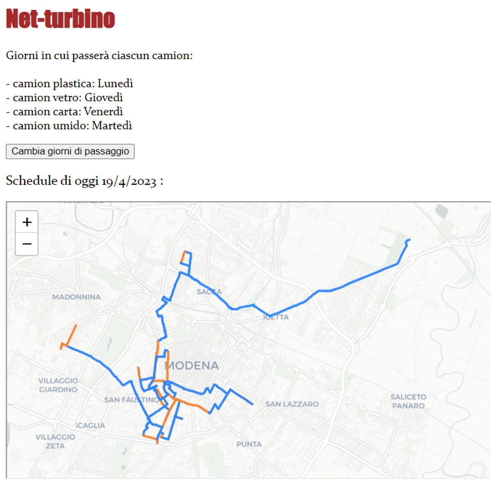

# Net-turbino (Smart Waste Management System)
This project, developed for the IoT course of the Master's degree, integrates hardware and software solutions for improving efficiency and sustainability while reducing operational costs, traffic, and environmental impact.

## Purpose and Objectives
*To Encourage:*   
- Efficiency in waste management services
- Environmental care
- Household waste segregation  

*To Decrease:*  
- Operational costs for waste management
- Traffic by minimizing truck movements
- Pollution
- Environmental impact

## System Components
### 1. The Device  
  
The device is a smart bin equipped with:
- Charging base
- Internal ultrasonic sensor
- External LEDs for charging status and alerts
- Software component implemented on an Arduino
We created a digital twin for every device.

### 2. The Bridge
  
Concept:
Each bridge is associated with a specific address and manages all the smart bins within that area.

Functionality:
Collects data from the sensors of the smart bins.
Receives and sends messages.
Transfers the collected data to the cloud using the MQTT protocol.

### 3. The Cloud 
The cloud module performs several key functions:

- Periodic Data Collection: It gathers data periodically from each bridge.
- Median Calculation: For each street, it computes an average fill-level statistic to select the streets that need service.
- Graph Construction: It builds a graph representing the road network.
- Optimal Routing: It employs Dijkstra’s algorithm to calculate the best route connecting the selected streets.

Implementation: Written in Python, integrating OpenStreetMap libraries.

### 4. User Interface  
For Waste Collection Trucks:
- Selection of service days.
- Automatic display of the optimized route.

For End Users:
- Telegram Bot Subscription:
  - Users subscribe to a Telegram bot. 
  - Receive advanced notifications on when to place their waste out.
- Intuitive LED Indicators:
  - Indicate low battery.
  - Signal the truck’s next morning route.

## Hardware and Software Implementation

### 1. Microcontroller 
  
*Functions:*
- Receives commands from the bridge to control the LED indicators.
- Communicates battery level and bin status.

*Components:*
- Sensor: HY-SRF05
- LEDs: Three LEDs (red, green, white)
- Radio: NRF24L01
- Battery: 10.5 Ah lithium battery
- Charging Module: USB charging port

### 2. Bridge
3.   
Developed in Python using the paho_mqtt library, the bridge is divided into two parts:

*MQTT Publisher:*
- Receives MQTT requests from the cloud.
- Ensures data consistency and communicates with the radio interface.

*Radio Interface:*
Implemented using a modified lib_nrf24 library for Raspberry Pi 4.
Manages radio traffic between the bridge and microcontrollers by defining communication channels (read and write) for each connected bin.

### 3. Subscriber Interface
This interface allows:

- Dynamic instantiation of virtual bins, automatically updated with data published periodically by the various bridges.
- Automatic creation of a hierarchical structure for the bins.
Example Command:  
  
This command turns on the red LED of the specified bin.

It also exposes methods to interact with physical bins, for example:  
set_address_light(): Changes the LED color of all bins of a specific type at a given address.

4. Cloud (Implementation Details)
Implemented in Python, the cloud module uses OpenStreetMap’s geographic database and the osmnx library.

*Algorithm:*

- Street List: Retrieves the list of streets requiring service by communicating with the bridges.
- Correction: Identifies streets in terms of starting and ending nodes, avoiding potential obstacles.
- Ordering: Sorts streets based on distance from the starting node.
- Greedy Selection: Chooses the next street based on proximity to the current position and the starting node of each street.

### 5. Telegram Bot
The bot is written in Python using the python-Telegram-bot library and offers the following functionalities:

**Subscription**: Initiated with the /start command.  
**Data Retrieval**: Fetches, via MQTT, the list of streets for service per city.  
**Address Entry**: Prompts users to enter the city, street, and house number (validated upon entry). The address is added to a list, which is then sent to the cloud server to compute the optimal route.  
**Address Modification**: Users can change their address using the /change command.  
**Notifications:**
If the calculated route includes the street corresponding to the user’s chat ID, a "service scheduled" notification is sent.
If no collection is planned for a specific street on a given day, a "service cancelled" message is sent to all associated chat IDs.

### 6. Garbage truck
Written in python, html, involving Flask library.  

